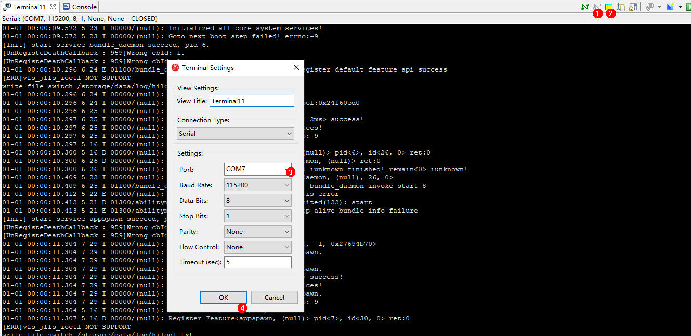
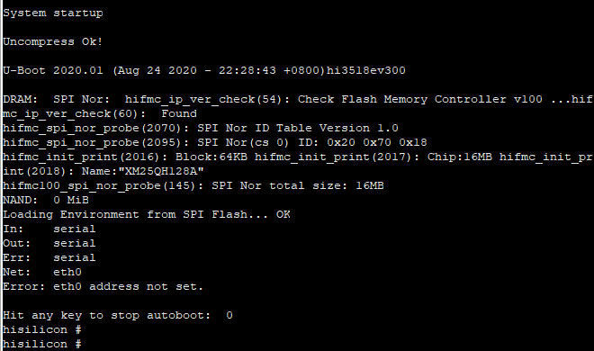
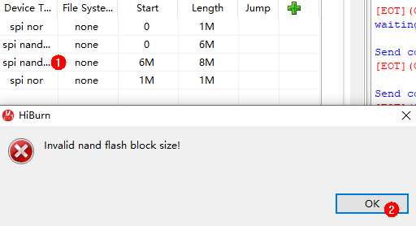

# FAQs<a name="EN-US_TOPIC_0000001053942318"></a>

1.  What should I do when no command output is displayed?
    -   **Symptom**

        The serial port shows that the connection has been established. After the board is restarted, nothing is displayed when you press  **Enter**.

    -   **Possible Cause 1**

        The serial port is connected incorrectly.

    -   **Solutions**

        Change the serial port number.

        Start  **Device Manager**  to check whether the serial port connected to the board is the same as that connected to the terminal device. If not, perform the following steps to change the serial port number.

        **Figure  1**  Procedure for changing the serial port number<a name="fig16441825145717"></a>  
        

        1.  Disconnect from the current serial port.
        2.  Click  **Settings**.
        3.  Change the serial port number in the dialog box and click  **OK**.
        4.  Press  **Enter**  in the dialog box to check whether any command output is displayed after the connection is established.

    -   **Possible Cause 2**

        The U-boot of the board is damaged.

    -   **Solutions**

        Burn the U-boot.

        If the fault persists after you perform the preceding operations, the U-boot of the board may be damaged. You can burn the U-boot by performing the following steps:

        1.  Obtain the U-boot file.

            > **NOTICE:** 
            >1.  The U-boot file of the board can be obtained from  **vendor\\hisi\\hi35xx\\hi3518ev300\\uboot\\out\\boot\\u-boot-hi3518ev300.bin**  in the open-source package.

        2.  Use HiTool to burn the U-boot.

            **Figure  2**  Procedure for burning the U-boot using HiTool<a name="fig53981233378"></a>  
            

            1. Select the COM7 serial port.

            2. Select  **Serial**  for  **Transfer Mode**.

            3. Select  **Burn Fastboot**.

            4. Select  **spi nor**  for  **Flash Type**.

            5. Click  **Browse**  and select the corresponding U-boot file.

            6. Click  **Burn**  to start burning.

        3.  Power off the board and then power it on. Connect the serial port after the burning is complete. Serial ports shown in the following figure are displayed after the U-boot is burnt.

            **Figure  3**  Serial port displayed after the U-boot is burnt<a name="fig103992331776"></a>  
            


2.  What should I do when an error is reported when the U-Boot is burnt using HiTool?
    -   **Symptom**

        **Figure  4**  Burning error<a name="fig466354874016"></a>  
        

        

    -   **Possible Causes**

        The flash type selected by HiTool is incorrect.

    -   **Solutions**

        Change the flash type in the area marked with  **1**  in the following figure.

        **Figure  5**  Incorrect flash type<a name="fig64931910194212"></a>  
        

        


3.  What should I do when the message indicating Python cannot be found is displayed during compilation and building?
    -   **Symptom**

        


    -   **Possible Cause 1**

        Python is not installed.

    -   **Solutions**

        Install the Python environment by referring to  [Installing a Python Environment](setting-up-a-development-environment-1.md#section918195118487).

    -   **Possible Cause 2**

        

    -   **Solutions**

        Run the following commands:

        ```
        # cd /usr/bin/
        # which python3
        # ln -s /usr/local/bin/python3 python
        # python --version
        ```

        Example:

        


