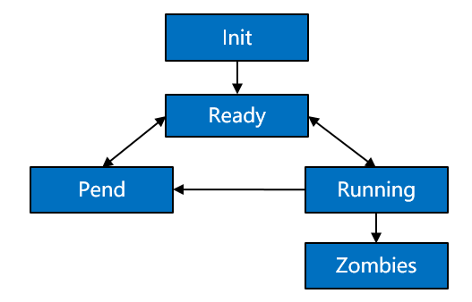

# 进程

## 基本概念

从系统的角度看，进程是资源管理单元。进程可以使用或等待CPU、使用内存空间等系统资源，并独立于其它进程运行。

OpenHarmony内核的进程模块可以给用户提供多个进程，实现了进程之间的切换和通信，帮助用户管理业务程序流程。这样用户可以将更多的精力投入到业务功能的实现中。

OpenHarmony内核中的进程采用抢占式调度机制，支持时间片轮转调度方式和FIFO调度机制。

OpenHarmony内核的进程一共有32个优先级\(0-31\)，用户进程可配置的优先级有22个\(10-31\)，最高优先级为10，最低优先级为31。

高优先级的进程可抢占低优先级进程，低优先级进程必须在高优先级进程阻塞或结束后才能得到调度。

每一个用户态进程均拥有自己独立的进程空间，相互之间不可见，实现进程间隔离。

用户态根进程init由内核态创建，其它用户态进程均由init进程fork而来。

**进程状态说明：**

-   初始化（Init）：该进程正在被创建。

-   就绪（Ready）：该进程在就绪列表中，等待CPU调度。

-   运行（Running）：该进程正在运行。

-   阻塞（Pend）：该进程被阻塞挂起。本进程内所有的线程均被阻塞时，进程被阻塞挂起。

-   僵尸态（Zombies）：该进程运行结束，等待父进程回收其控制块资源。

**图 1**  进程状态迁移示意图  

**进程状态迁移说明：**

-   Init→Ready：

    进程创建或fork时，拿到该进程控制块后进入Init状态，处于进程初始化阶段，当进程初始化完成将进程插入调度队列，此时进程进入就绪状态。

-   Ready→Running：

    进程创建后进入就绪态，发生进程切换时，就绪列表中最高优先级的进程被执行，从而进入运行态。若此时该进程中已无其它线程处于就绪态，则该进程从就绪列表删除，只处于运行态；若此时该进程中还有其它线程处于就绪态，则该进程依旧在就绪队列，此时进程的就绪态和运行态共存。

-   Running→Pend：

    进程内所有的线程均处于阻塞态时，进程在最后一个线程转为阻塞态时，同步进入阻塞态，然后发生进程切换。

-   Pend→Ready / Pend→Running：

    阻塞进程内的任意线程恢复就绪态时，进程被加入到就绪队列，同步转为就绪态，若此时发生进程切换，则进程状态由就绪态转为运行态。

-   Ready→Pend：

    进程内的最后一个就绪态线程处于阻塞态时，进程从就绪列表中删除，进程由就绪态转为阻塞态。

-   Running→Ready：

    进程由运行态转为就绪态的情况有以下两种：

    1.  有更高优先级的进程创建或者恢复后，会发生进程调度，此刻就绪列表中最高优先级进程变为运行态，那么原先运行的进程由运行态变为就绪态。
    2.  若进程的调度策略为SCHED\_RR，且存在同一优先级的另一个进程处于就绪态，则该进程的时间片消耗光之后，该进程由运行态转为就绪态，另一个同优先级的进程由就绪态转为运行态。

-   Running→Zombies：

    当进程的主线程或所有线程运行结束后，进程由运行态转为僵尸态，等待父进程回收资源。

## 使用场景

进程创建后，用户只能操作自己进程空间的资源，无法操作其它进程的资源（共享资源除外）。 用户态允许进程挂起，恢复，延时等操作，同时也可以设置用户态进程调度优先级和调度策略，获取进程调度优先级和调度策略。进程结束的时候，进程会主动释放持有的进程资源，但持有的进程pid资源需要父进程通过wait/waitpid或父进程退出时回收。

## 功能

OpenHarmony内核系统中的进程管理模块为用户提供下面几种功能：

**表 1**  进程管理模块功能

<table><thead align="left"><tr id="row630210427446"><th class="cellrowborder" valign="top" width="13.08%" id="mcps1.2.5.1.1">
功能分类

</th>
<th class="cellrowborder" valign="top" width="23.09%" id="mcps1.2.5.1.2">
接口名

</th>
<th class="cellrowborder" valign="top" width="28.82%" id="mcps1.2.5.1.3">
描述

</th>
<th class="cellrowborder" valign="top" width="35.010000000000005%" id="mcps1.2.5.1.4">
备注

</th>
</tr>
</thead>
<tbody><tr id="row12302642134414"><td class="cellrowborder" rowspan="13" valign="top" width="13.08%" headers="mcps1.2.5.1.1 ">
进程

</td>
<td class="cellrowborder" valign="top" width="23.09%" headers="mcps1.2.5.1.2 ">
fork

</td>
<td class="cellrowborder" valign="top" width="28.82%" headers="mcps1.2.5.1.3 ">
创建一个新进程。

</td>
<td class="cellrowborder" valign="top" width="35.010000000000005%" headers="mcps1.2.5.1.4 ">
-

</td>
</tr>
<tr id="row20302154218442"><td class="cellrowborder" valign="top" headers="mcps1.2.5.1.1 ">
exit

</td>
<td class="cellrowborder" valign="top" headers="mcps1.2.5.1.2 ">
终止进程。

</td>
<td class="cellrowborder" valign="top" headers="mcps1.2.5.1.3 ">
-

</td>
</tr>
<tr id="row930314421443"><td class="cellrowborder" valign="top" headers="mcps1.2.5.1.1 ">
atexit

</td>
<td class="cellrowborder" valign="top" headers="mcps1.2.5.1.2 ">
注册正常进程终止的回调函数。

</td>
<td class="cellrowborder" valign="top" headers="mcps1.2.5.1.3 ">
-

</td>
</tr>
<tr id="row113039426449"><td class="cellrowborder" valign="top" headers="mcps1.2.5.1.1 ">
abort

</td>
<td class="cellrowborder" valign="top" headers="mcps1.2.5.1.2 ">
中止进程执行。

</td>
<td class="cellrowborder" valign="top" headers="mcps1.2.5.1.3 ">
-

</td>
</tr>
<tr id="row1330317422445"><td class="cellrowborder" valign="top" headers="mcps1.2.5.1.1 ">
getpid

</td>
<td class="cellrowborder" valign="top" headers="mcps1.2.5.1.2 ">
获取进程ID。

</td>
<td class="cellrowborder" valign="top" headers="mcps1.2.5.1.3 ">
-

</td>
</tr>
<tr id="row3304204254412"><td class="cellrowborder" valign="top" headers="mcps1.2.5.1.1 ">
getppid

</td>
<td class="cellrowborder" valign="top" headers="mcps1.2.5.1.2 ">
获取父进程ID。

</td>
<td class="cellrowborder" valign="top" headers="mcps1.2.5.1.3 ">
-

</td>
</tr>
<tr id="row610863618327"><td class="cellrowborder" valign="top" headers="mcps1.2.5.1.1 ">
getpgrp

</td>
<td class="cellrowborder" valign="top" headers="mcps1.2.5.1.2 ">
获取调用进程的进程组ID。

</td>
<td class="cellrowborder" valign="top" headers="mcps1.2.5.1.3 ">
-

</td>
</tr>
<tr id="row2379940183217"><td class="cellrowborder" valign="top" headers="mcps1.2.5.1.1 ">
getpgid

</td>
<td class="cellrowborder" valign="top" headers="mcps1.2.5.1.2 ">
获取进程的进程组ID。

</td>
<td class="cellrowborder" valign="top" headers="mcps1.2.5.1.3 ">
-

</td>
</tr>
<tr id="row1981395963412"><td class="cellrowborder" valign="top" headers="mcps1.2.5.1.1 ">
setpgrp

</td>
<td class="cellrowborder" valign="top" headers="mcps1.2.5.1.2 ">
设置调用进程的进程组ID。

</td>
<td class="cellrowborder" valign="top" headers="mcps1.2.5.1.3 ">
-

</td>
</tr>
<tr id="row194862793516"><td class="cellrowborder" valign="top" headers="mcps1.2.5.1.1 ">
setpgid

</td>
<td class="cellrowborder" valign="top" headers="mcps1.2.5.1.2 ">
设置进程的进程组ID。

</td>
<td class="cellrowborder" valign="top" headers="mcps1.2.5.1.3 ">
-

</td>
</tr>
<tr id="row10304742114410"><td class="cellrowborder" valign="top" headers="mcps1.2.5.1.1 ">
kill

</td>
<td class="cellrowborder" valign="top" headers="mcps1.2.5.1.2 ">
给进程发送信号。

</td>
<td class="cellrowborder" valign="top" headers="mcps1.2.5.1.3 "><ul id="ul949915272011"><li>仅支持1-30号信号的发送。</li><li>信号的默认行为不支持STOP及CONTINUE，无COREDUMP功能。</li><li>不能屏蔽SIGSTOP、SIGKILL、SIGCONT。</li><li>异步信号，发送信号给某进程后，直到该进程被调度后才会执行信号回调（为安全起见，杀死进程的动作是进程自己执行的，内核不能通过信号强制杀死对方）。</li><li>进程消亡会发送SIGCHLD给父进程，发送动作无法取消。</li><li>无法通过信号唤醒正在睡眠的进程。</li></ul>
</td>
</tr>
<tr id="row1430454210446"><td class="cellrowborder" valign="top" headers="mcps1.2.5.1.1 ">
wait

</td>
<td class="cellrowborder" valign="top" headers="mcps1.2.5.1.2 ">
等待任意子进程结束并回收子进程资源。

</td>
<td class="cellrowborder" valign="top" headers="mcps1.2.5.1.3 ">
status的值可以由以下宏定义解析：

<ul id="ul13349201524417"><li>WIFEXITED(status):如果子进程正常结束，它就返回真；否则返回假。</li><li>WEXITSTATUS(status):如果WIFEXITED(status)为真，则可以用该宏取得子进程exit()返回的退出码。</li><li>WTERMSIG(status) 仅支持以下情况：子进程触发异常结束后通过WTERMSIG获取的进程退出编号始终为SIGUSR2。</li><li>不支持的操作： WIFSTOPPED、WSTOPSIG、WCOREDUMP 、WIFCONTINUED。</li></ul>
</td>
</tr>
<tr id="row13041742134416"><td class="cellrowborder" valign="top" headers="mcps1.2.5.1.1 ">
waitpid

</td>
<td class="cellrowborder" valign="top" headers="mcps1.2.5.1.2 ">
等待子进程结束并回收子进程资源。

</td>
<td class="cellrowborder" valign="top" headers="mcps1.2.5.1.3 ">
options：不支持WUNTRACED，WCONTINUED；

status的值可以由以下宏定义解析：

<ul id="ul7243133164416"><li>WIFEXITED(status):如果子进程正常结束，它就返回真；否则返回假。</li><li>WEXITSTATUS(status):如果WIFEXITED(status)为真，则可以用该宏取得子进程exit()返回的退出码。</li><li>WTERMSIG(status)仅支持以下情况：子进程触发异常结束后通过WTERMSIG获取的进程退出编号始终为SIGUSR2。</li><li>不支持：WIFSTOPPED 、WSTOPSIG、WCOREDUMP 、WIFCONTINUED。</li></ul>
</td>
</tr>
<tr id="row4305194294417"><td class="cellrowborder" rowspan="10" valign="top" width="13.08%" headers="mcps1.2.5.1.1 ">
调度

</td>
<td class="cellrowborder" valign="top" width="23.09%" headers="mcps1.2.5.1.2 ">
getpriority

</td>
<td class="cellrowborder" valign="top" width="28.82%" headers="mcps1.2.5.1.3 ">
获取指定ID的静态优先级。

</td>
<td class="cellrowborder" rowspan="2" valign="top" width="35.010000000000005%" headers="mcps1.2.5.1.4 "><ul id="ul185518513478"><li>不支持：PRIO_PGRP、PRIO_USER。</li></ul>
<ul id="ul85091358174711"><li>无动态优先级概念，用于设置静态优先级。</li></ul>
</td>
</tr>
<tr id="row930511425448"><td class="cellrowborder" valign="top" headers="mcps1.2.5.1.1 ">
setpriority

</td>
<td class="cellrowborder" valign="top" headers="mcps1.2.5.1.2 ">
设置指定ID的静态优先级。

</td>
</tr>
<tr id="row2305174216445"><td class="cellrowborder" valign="top" headers="mcps1.2.5.1.1 ">
sched_rr_get_interval

</td>
<td class="cellrowborder" valign="top" headers="mcps1.2.5.1.2 ">
获取执行时间限制。

</td>
<td class="cellrowborder" valign="top" headers="mcps1.2.5.1.3 ">
-

</td>
</tr>
<tr id="row33061042104416"><td class="cellrowborder" valign="top" headers="mcps1.2.5.1.1 ">
sched_yield

</td>
<td class="cellrowborder" valign="top" headers="mcps1.2.5.1.2 ">
系统调用运行进程主动让出执行权。

</td>
<td class="cellrowborder" valign="top" headers="mcps1.2.5.1.3 ">
-

</td>
</tr>
<tr id="row11306134234417"><td class="cellrowborder" valign="top" headers="mcps1.2.5.1.1 ">
sched_get_priority_max

</td>
<td class="cellrowborder" valign="top" headers="mcps1.2.5.1.2 ">
获取进程静态优先级取值范围的最大值。

</td>
<td class="cellrowborder" rowspan="4" valign="top" headers="mcps1.2.5.1.3 ">
调度策略只支持：SCHED_FIFO 、SCHED_RR。

</td>
</tr>
<tr id="row15306242124413"><td class="cellrowborder" valign="top" headers="mcps1.2.5.1.1 ">
sched_get_priority_min

</td>
<td class="cellrowborder" valign="top" headers="mcps1.2.5.1.2 ">
获取进程静态优先级取值范围的最小值。

</td>
</tr>
<tr id="row730610428448"><td class="cellrowborder" valign="top" headers="mcps1.2.5.1.1 ">
sched_getscheduler

</td>
<td class="cellrowborder" valign="top" headers="mcps1.2.5.1.2 ">
获取调度策略。

</td>
</tr>
<tr id="row630764215441"><td class="cellrowborder" valign="top" headers="mcps1.2.5.1.1 ">
sched_setscheduler

</td>
<td class="cellrowborder" valign="top" headers="mcps1.2.5.1.2 ">
设置调度策略。

</td>
</tr>
<tr id="row3307184274411"><td class="cellrowborder" valign="top" headers="mcps1.2.5.1.1 ">
sched_getparam

</td>
<td class="cellrowborder" valign="top" headers="mcps1.2.5.1.2 ">
获取调度参数。

</td>
<td class="cellrowborder" valign="top" headers="mcps1.2.5.1.3 ">
-

</td>
</tr>
<tr id="row18307104210449"><td class="cellrowborder" valign="top" headers="mcps1.2.5.1.1 ">
sched_setparam

</td>
<td class="cellrowborder" valign="top" headers="mcps1.2.5.1.2 ">
设置调度参数。

</td>
<td class="cellrowborder" valign="top" headers="mcps1.2.5.1.3 ">
-

</td>
</tr>
<tr id="row17412918306"><td class="cellrowborder" rowspan="6" valign="top" width="13.08%" headers="mcps1.2.5.1.1 ">
exec

</td>
<td class="cellrowborder" valign="top" width="23.09%" headers="mcps1.2.5.1.2 ">
execl

</td>
<td class="cellrowborder" valign="top" width="28.82%" headers="mcps1.2.5.1.3 ">
执行指定的elf格式的用户程序文件。

</td>
<td class="cellrowborder" valign="top" width="35.010000000000005%" headers="mcps1.2.5.1.4 ">
-

</td>
</tr>
<tr id="row16964151163015"><td class="cellrowborder" valign="top" headers="mcps1.2.5.1.1 ">
execle

</td>
<td class="cellrowborder" valign="top" headers="mcps1.2.5.1.2 ">
执行指定的elf格式的用户程序文件。

</td>
<td class="cellrowborder" valign="top" headers="mcps1.2.5.1.3 ">
-

</td>
</tr>
<tr id="row9418101418309"><td class="cellrowborder" valign="top" headers="mcps1.2.5.1.1 ">
execlp

</td>
<td class="cellrowborder" valign="top" headers="mcps1.2.5.1.2 ">
执行指定的elf格式的用户程序文件。

</td>
<td class="cellrowborder" valign="top" headers="mcps1.2.5.1.3 ">
-

</td>
</tr>
<tr id="row2058611176305"><td class="cellrowborder" valign="top" headers="mcps1.2.5.1.1 ">
execv

</td>
<td class="cellrowborder" valign="top" headers="mcps1.2.5.1.2 ">
执行指定的elf格式的用户程序文件。

</td>
<td class="cellrowborder" valign="top" headers="mcps1.2.5.1.3 ">
-

</td>
</tr>
<tr id="row182359476306"><td class="cellrowborder" valign="top" headers="mcps1.2.5.1.1 ">
execve

</td>
<td class="cellrowborder" valign="top" headers="mcps1.2.5.1.2 ">
执行指定的elf格式的用户程序文件。

</td>
<td class="cellrowborder" valign="top" headers="mcps1.2.5.1.3 ">
-

</td>
</tr>
<tr id="row14242145013304"><td class="cellrowborder" valign="top" headers="mcps1.2.5.1.1 ">
execvp

</td>
<td class="cellrowborder" valign="top" headers="mcps1.2.5.1.2 ">
执行指定的elf格式的用户程序文件。

</td>
<td class="cellrowborder" valign="top" headers="mcps1.2.5.1.3 ">
-

</td>
</tr>
</tbody>
</table>

