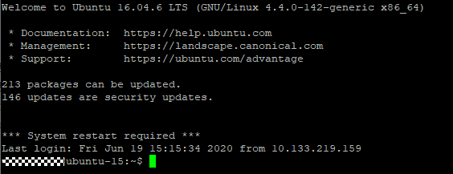

# 搭建环境<a name="ZH-CN_TOPIC_0000001054022306"></a>

## 环境要求<a name="section1724111409282"></a>

## 硬件要求<a name="section185788208272"></a>

-   Linux服务器
-   Windows工作台（主机电脑）
-   Hi3518EV300 IoT Camera开发板
-   USB线、网线（Windows工作台通过USB线、网线与开发板连接）

    各硬件连接关系如下图所示。


**图 1**  硬件连线图<a name="fig8211468392"></a>  


## h2软件系统要求<a name="section383442213405"></a>

**表 1**  开发板开发平台要求

<a name="table16641975408"></a>
<table><thead align="left"><tr id="row196634713405"><th class="cellrowborder" valign="top" width="8.53%" id="mcps1.2.5.1.1"><p id="p116632718408"><a name="p116632718408"></a><a name="p116632718408"></a>硬件</p>
</th>
<th class="cellrowborder" valign="top" width="11.66%" id="mcps1.2.5.1.2"><p id="p1766312724017"><a name="p1766312724017"></a><a name="p1766312724017"></a>软件</p>
</th>
<th class="cellrowborder" valign="top" width="66%" id="mcps1.2.5.1.3"><p id="p666327144010"><a name="p666327144010"></a><a name="p666327144010"></a>描述</p>
</th>
<th class="cellrowborder" valign="top" width="13.81%" id="mcps1.2.5.1.4"><p id="p106631273406"><a name="p106631273406"></a><a name="p106631273406"></a>备注</p>
</th>
</tr>
</thead>
<tbody><tr id="row066315717402"><td class="cellrowborder" valign="top" width="8.53%" headers="mcps1.2.5.1.1 "><p id="p666318712403"><a name="p666318712403"></a><a name="p666318712403"></a>Linux编译服务器</p>
</td>
<td class="cellrowborder" valign="top" width="11.66%" headers="mcps1.2.5.1.2 "><p id="p76632712403"><a name="p76632712403"></a><a name="p76632712403"></a>操作系统</p>
</td>
<td class="cellrowborder" valign="top" width="66%" headers="mcps1.2.5.1.3 "><p id="p15663127204015"><a name="p15663127204015"></a><a name="p15663127204015"></a>Ubuntu16.04及以上64位系统版本，Shell使用bash。</p>
<div class="note" id="note196631578401"><a name="note196631578401"></a><a name="note196631578401"></a><span class="notetitle"> 说明： </span><div class="notebody"><p id="p1466311720406"><a name="p1466311720406"></a><a name="p1466311720406"></a>通常系统默认安装samba、vim等常用软件，需要做适当适配以支持linux文件共享。</p>
</div></div>
</td>
<td class="cellrowborder" rowspan="2" valign="top" width="13.81%" headers="mcps1.2.5.1.4 "><p id="p96631975404"><a name="p96631975404"></a><a name="p96631975404"></a>开发人员可以在Windows工作台中进行程序开发，或者远程登录到Linux服务器进行程序开发。</p>
</td>
</tr>
<tr id="row19664272408"><td class="cellrowborder" valign="top" headers="mcps1.2.5.1.1 "><p id="p1366314764011"><a name="p1366314764011"></a><a name="p1366314764011"></a>Windows工作台</p>
</td>
<td class="cellrowborder" valign="top" headers="mcps1.2.5.1.2 "><p id="p15663177204019"><a name="p15663177204019"></a><a name="p15663177204019"></a>操作系统</p>
</td>
<td class="cellrowborder" valign="top" headers="mcps1.2.5.1.3 "><p id="p1766411719408"><a name="p1766411719408"></a><a name="p1766411719408"></a>Windows XP/Windows7/Windows10</p>
</td>
</tr>
</tbody>
</table>

## Linux构建工具要求<a name="section11111412465"></a>

Linux服务器通用环境配置需要的工具及其获取途径如下表所示。

**表 2**  Linux服务器开发工具及获取途径

<a name="zh-cn_topic_0000001054501981_table6299192712513"></a>
<table><thead align="left"><tr id="zh-cn_topic_0000001054501981_row122993276512"><th class="cellrowborder" valign="top" width="13.081308130813083%" id="mcps1.2.4.1.1"><p id="zh-cn_topic_0000001054501981_p1829914271858"><a name="zh-cn_topic_0000001054501981_p1829914271858"></a><a name="zh-cn_topic_0000001054501981_p1829914271858"></a>开发工具</p>
</th>
<th class="cellrowborder" valign="top" width="19.921992199219922%" id="mcps1.2.4.1.2"><p id="zh-cn_topic_0000001054501981_p429918274517"><a name="zh-cn_topic_0000001054501981_p429918274517"></a><a name="zh-cn_topic_0000001054501981_p429918274517"></a>用途</p>
</th>
<th class="cellrowborder" valign="top" width="66.996699669967%" id="mcps1.2.4.1.3"><p id="zh-cn_topic_0000001054501981_p12997271757"><a name="zh-cn_topic_0000001054501981_p12997271757"></a><a name="zh-cn_topic_0000001054501981_p12997271757"></a>获取途径</p>
</th>
</tr>
</thead>
<tbody><tr id="zh-cn_topic_0000001054501981_row430016273514"><td class="cellrowborder" valign="top" width="13.081308130813083%" headers="mcps1.2.4.1.1 "><p id="zh-cn_topic_0000001054501981_p330015271158"><a name="zh-cn_topic_0000001054501981_p330015271158"></a><a name="zh-cn_topic_0000001054501981_p330015271158"></a>Python3.7+</p>
</td>
<td class="cellrowborder" valign="top" width="19.921992199219922%" headers="mcps1.2.4.1.2 "><p id="zh-cn_topic_0000001054501981_p43003270510"><a name="zh-cn_topic_0000001054501981_p43003270510"></a><a name="zh-cn_topic_0000001054501981_p43003270510"></a>执行编译脚本工具</p>
</td>
<td class="cellrowborder" valign="top" width="66.996699669967%" headers="mcps1.2.4.1.3 "><p id="zh-cn_topic_0000001054501981_p18254155164617"><a name="zh-cn_topic_0000001054501981_p18254155164617"></a><a name="zh-cn_topic_0000001054501981_p18254155164617"></a><a href="https://www.python.org/ftp/python/3.8.5/Python-3.8.5.tgz" target="_blank" rel="noopener noreferrer">https://www.python.org/ftp/python/3.8.5/Python-3.8.5.tgz</a></p>
</td>
</tr>
<tr id="zh-cn_topic_0000001054501981_row42668197206"><td class="cellrowborder" valign="top" width="13.081308130813083%" headers="mcps1.2.4.1.1 "><p id="zh-cn_topic_0000001054501981_p426711912014"><a name="zh-cn_topic_0000001054501981_p426711912014"></a><a name="zh-cn_topic_0000001054501981_p426711912014"></a>bash</p>
</td>
<td class="cellrowborder" valign="top" width="19.921992199219922%" headers="mcps1.2.4.1.2 "><p id="zh-cn_topic_0000001054501981_p14267131962014"><a name="zh-cn_topic_0000001054501981_p14267131962014"></a><a name="zh-cn_topic_0000001054501981_p14267131962014"></a>执行命令行工具</p>
</td>
<td class="cellrowborder" valign="top" width="66.996699669967%" headers="mcps1.2.4.1.3 "><p id="zh-cn_topic_0000001054501981_p14267101962014"><a name="zh-cn_topic_0000001054501981_p14267101962014"></a><a name="zh-cn_topic_0000001054501981_p14267101962014"></a>通过互联网获取</p>
</td>
</tr>
<tr id="zh-cn_topic_0000001054501981_row1711946154018"><td class="cellrowborder" valign="top" width="13.081308130813083%" headers="mcps1.2.4.1.1 "><p id="zh-cn_topic_0000001054501981_p15588165684216"><a name="zh-cn_topic_0000001054501981_p15588165684216"></a><a name="zh-cn_topic_0000001054501981_p15588165684216"></a>gn</p>
</td>
<td class="cellrowborder" valign="top" width="19.921992199219922%" headers="mcps1.2.4.1.2 "><p id="zh-cn_topic_0000001054501981_p4588135634213"><a name="zh-cn_topic_0000001054501981_p4588135634213"></a><a name="zh-cn_topic_0000001054501981_p4588135634213"></a>产生ninja编译脚本</p>
</td>
<td class="cellrowborder" valign="top" width="66.996699669967%" headers="mcps1.2.4.1.3 "><p id="zh-cn_topic_0000001054501981_p10572194318318"><a name="zh-cn_topic_0000001054501981_p10572194318318"></a><a name="zh-cn_topic_0000001054501981_p10572194318318"></a><a href="https://repo.huaweicloud.com/harmonyos/compiler/gn/1523/linux/gn.1523.tar" target="_blank" rel="noopener noreferrer">https://repo.huaweicloud.com/harmonyos/compiler/gn/1523/linux/gn.1523.tar</a></p>
</td>
</tr>
<tr id="zh-cn_topic_0000001054501981_row16990164213404"><td class="cellrowborder" valign="top" width="13.081308130813083%" headers="mcps1.2.4.1.1 "><p id="zh-cn_topic_0000001054501981_p1858825613428"><a name="zh-cn_topic_0000001054501981_p1858825613428"></a><a name="zh-cn_topic_0000001054501981_p1858825613428"></a>ninja</p>
</td>
<td class="cellrowborder" valign="top" width="19.921992199219922%" headers="mcps1.2.4.1.2 "><p id="zh-cn_topic_0000001054501981_p15844174611816"><a name="zh-cn_topic_0000001054501981_p15844174611816"></a><a name="zh-cn_topic_0000001054501981_p15844174611816"></a>执行ninja编译脚本</p>
</td>
<td class="cellrowborder" valign="top" width="66.996699669967%" headers="mcps1.2.4.1.3 "><p id="zh-cn_topic_0000001054501981_p1923373393515"><a name="zh-cn_topic_0000001054501981_p1923373393515"></a><a name="zh-cn_topic_0000001054501981_p1923373393515"></a><a href="https://repo.huaweicloud.com/harmonyos/compiler/ninja/1.9.0/linux/ninja.1.9.0.tar" target="_blank" rel="noopener noreferrer">https://repo.huaweicloud.com/harmonyos/compiler/ninja/1.9.0/linux/ninja.1.9.0.tar</a></p>
</td>
</tr>
<tr id="zh-cn_topic_0000001054501981_row192161027104010"><td class="cellrowborder" valign="top" width="13.081308130813083%" headers="mcps1.2.4.1.1 "><p id="zh-cn_topic_0000001054501981_p15217227174016"><a name="zh-cn_topic_0000001054501981_p15217227174016"></a><a name="zh-cn_topic_0000001054501981_p15217227174016"></a>LLVM</p>
</td>
<td class="cellrowborder" valign="top" width="19.921992199219922%" headers="mcps1.2.4.1.2 "><p id="zh-cn_topic_0000001054501981_p122171727184019"><a name="zh-cn_topic_0000001054501981_p122171727184019"></a><a name="zh-cn_topic_0000001054501981_p122171727184019"></a>编译工具链</p>
</td>
<td class="cellrowborder" valign="top" width="66.996699669967%" headers="mcps1.2.4.1.3 "><p id="zh-cn_topic_0000001054501981_p0191147134415"><a name="zh-cn_topic_0000001054501981_p0191147134415"></a><a name="zh-cn_topic_0000001054501981_p0191147134415"></a><a href="https://repo.huaweicloud.com/harmonyos/compiler/clang/9.0.0-34042/linux/llvm-linux-9.0.0-34042.tar" target="_blank" rel="noopener noreferrer">https://repo.huaweicloud.com/harmonyos/compiler/clang/9.0.0-34042/linux/llvm-linux-9.0.0-34042.tar</a></p>
</td>
</tr>
<tr id="zh-cn_topic_0000001054501981_row18516509507"><td class="cellrowborder" valign="top" width="13.081308130813083%" headers="mcps1.2.4.1.1 "><p id="zh-cn_topic_0000001054501981_p14521650135017"><a name="zh-cn_topic_0000001054501981_p14521650135017"></a><a name="zh-cn_topic_0000001054501981_p14521650135017"></a>hc-gen</p>
</td>
<td class="cellrowborder" valign="top" width="19.921992199219922%" headers="mcps1.2.4.1.2 "><p id="zh-cn_topic_0000001054501981_p125255010501"><a name="zh-cn_topic_0000001054501981_p125255010501"></a><a name="zh-cn_topic_0000001054501981_p125255010501"></a>驱动配置编译工具</p>
</td>
<td class="cellrowborder" valign="top" width="66.996699669967%" headers="mcps1.2.4.1.3 "><p id="zh-cn_topic_0000001054501981_p145061517114519"><a name="zh-cn_topic_0000001054501981_p145061517114519"></a><a name="zh-cn_topic_0000001054501981_p145061517114519"></a><a href="https://repo.huaweicloud.com/harmonyos/compiler/hc-gen/0.65/linux/hc-gen-0.65-linux.tar" target="_blank" rel="noopener noreferrer">https://repo.huaweicloud.com/harmonyos/compiler/hc-gen/0.65/linux/hc-gen-0.65-linux.tar</a></p>
</td>
</tr>
<tr id="zh-cn_topic_0000001054501981_row105773499422"><td class="cellrowborder" valign="top" width="13.081308130813083%" headers="mcps1.2.4.1.1 "><p id="zh-cn_topic_0000001054501981_p15300102717517"><a name="zh-cn_topic_0000001054501981_p15300102717517"></a><a name="zh-cn_topic_0000001054501981_p15300102717517"></a>IPOP、PuTTY或其他超级终端</p>
</td>
<td class="cellrowborder" valign="top" width="19.921992199219922%" headers="mcps1.2.4.1.2 "><p id="zh-cn_topic_0000001054501981_p109418530386"><a name="zh-cn_topic_0000001054501981_p109418530386"></a><a name="zh-cn_topic_0000001054501981_p109418530386"></a>连接Linux服务器工具（任选其一）</p>
</td>
<td class="cellrowborder" valign="top" width="66.996699669967%" headers="mcps1.2.4.1.3 "><p id="zh-cn_topic_0000001054501981_p7312122523813"><a name="zh-cn_topic_0000001054501981_p7312122523813"></a><a name="zh-cn_topic_0000001054501981_p7312122523813"></a>通过互联网获取（如：<a href="https://www.putty.org/" target="_blank" rel="noopener noreferrer">https://www.putty.org/</a>）</p>
</td>
</tr>
</tbody>
</table>

## Windows开发工具要求<a name="section11161833102716"></a>

**表 3**  Windows工作台开发工具及获取途径

<a name="table1313323311274"></a>
<table><thead align="left"><tr id="row3133133312711"><th class="cellrowborder" valign="top" width="16.371637163716375%" id="mcps1.2.4.1.1"><p id="p16132203372716"><a name="p16132203372716"></a><a name="p16132203372716"></a>开发工具</p>
</th>
<th class="cellrowborder" valign="top" width="37.04370437043704%" id="mcps1.2.4.1.2"><p id="p1413219339278"><a name="p1413219339278"></a><a name="p1413219339278"></a>用途</p>
</th>
<th class="cellrowborder" valign="top" width="46.58465846584659%" id="mcps1.2.4.1.3"><p id="p17133183312711"><a name="p17133183312711"></a><a name="p17133183312711"></a>获取途径</p>
</th>
</tr>
</thead>
<tbody><tr id="row13697410143219"><td class="cellrowborder" valign="top" width="16.371637163716375%" headers="mcps1.2.4.1.1 "><p id="p163612016916"><a name="p163612016916"></a><a name="p163612016916"></a>Visual Studio Code</p>
</td>
<td class="cellrowborder" valign="top" width="37.04370437043704%" headers="mcps1.2.4.1.2 "><p id="p1563690791"><a name="p1563690791"></a><a name="p1563690791"></a>代码编辑工具</p>
</td>
<td class="cellrowborder" valign="top" width="46.58465846584659%" headers="mcps1.2.4.1.3 "><p id="p146361701097"><a name="p146361701097"></a><a name="p146361701097"></a><a href="https://code.visualstudio.com/" target="_blank" rel="noopener noreferrer">https://code.visualstudio.com/</a></p>
</td>
</tr>
<tr id="row12133123315277"><td class="cellrowborder" valign="top" width="16.371637163716375%" headers="mcps1.2.4.1.1 "><p id="p613393317271"><a name="p613393317271"></a><a name="p613393317271"></a>HiTool工具</p>
</td>
<td class="cellrowborder" valign="top" width="37.04370437043704%" headers="mcps1.2.4.1.2 "><p id="p201334121092"><a name="p201334121092"></a><a name="p201334121092"></a>U-boot，镜像文件烧写工具</p>
</td>
<td class="cellrowborder" valign="top" width="46.58465846584659%" headers="mcps1.2.4.1.3 "><p id="p2014134844017"><a name="p2014134844017"></a><a name="p2014134844017"></a><a href="http://www.hihope.org/download/AllDocuments" target="_blank" rel="noopener noreferrer">http://www.hihope.org/download/AllDocuments</a></p>
<p id="p141194824119"><a name="p141194824119"></a><a name="p141194824119"></a>工具软件名：Hi3516-Hitool.zip</p>
</td>
</tr>
</tbody>
</table>

## 安装编译基础环境<a name="section7813043104310"></a>

## 连接Linux服务器<a name="section111021456154718"></a>

使用Windows远程登录Linux，以PUTTY工具为例：

1.  打开[PuTTY工具](https://www.putty.org/)，输入Linux服务器IP地址，后点击“open”，打开连接。

    **图 2**  PuTTY界面示例图<a name="zh-cn_topic_0000001054501981_zh-cn_topic_0000001054781998_f825e6d7569cc487db9b744e454c7157a"></a>  
    

2.  弹框告警选择“是\(Y\)”。
3.  弹出界面中输入账号并按回车键，继续输入密码并回车键。

    **图 3**  登录界面图<a name="zh-cn_topic_0000001054501981_zh-cn_topic_0000001054781998_fe1428afffbdd45f9b4a39497691ff5ff"></a>  
    

4.  登录成功。

    **图 4**  登录成功界面<a name="zh-cn_topic_0000001054501981_zh-cn_topic_0000001054781998_f11bea69483e14bd39fef4a10b1ed1a3a"></a>  
    


## 将Linux shell改为bash<a name="section980212574810"></a>

查看shell是否为bash，在终端运行如下命令

```
ls -l /bin/sh
```

如果显示为“/bin/sh -\> bash”则为正常，否则请按以下方式修改：

**方法一**：在终端运行如下命令，然后选择 no。

```
sudo dpkg-reconfigure dash
```

**方法二**：先删除sh，再创建软链接。

```
sudo rm -rf /bin/sh
sudo ln -s /bin/bash /bin/sh
```

## 安装Python环境<a name="section918195118487"></a>

1.  打开Linux编译服务器终端。
2.  输入如下命令，查看Python版本号，需使用python3.7以上版本。

    ```
    python3 --version
    ```

    以python3.8为例，按照以下步骤安装python。

    1.  运行如下命令，查看Ubuntu版本：

    ```
    cat /etc/issue
    ```

    1.  根据Ubuntu不同版本，安装python。
        -   如果Ubuntu 版本为18+，运行如下命令。

            ```
            sudo apt-get install python3.8
            ```

        -   如果Ubuntu版本为16，请以下载包的方式安装python。

            1.  python安装环境依赖\(gcc, g++, make, zlib, libffi\)请运行如下命令：

            ```
            sudo apt-get install gcc && sudo apt-get install g++ && sudo apt-get install make && sudo apt-get install zlib* && sudo apt-get install libffi-dev
            ```

            1.  获取[python3.8.5安装包](https://www.python.org/ftp/python/3.8.5/Python-3.8.5.tgz)，将其放至linux服务器中，运行如下命令 ：

            ```
            tar -xvzf Python-3.8.5.tgz && cd Python-3.8.5 && sudo ./configure && sudo make && sudo make install
            ```


3.  确定Python安装好后，运行如下命令，将python路径链接到"/usr/bin/python"。

    ```
    which python3.8
    cd /usr/bin && sudo rm python && sudo ln -s /usr/local/bin/python3.8 python && python --version
    ```

4.  安装并升级Python包管理工具（pip3），任选如下一种方式。
    -   **命令行方式：**

        ```
        sudo apt-get install python3-setuptools python3-pip -y
        sudo pip3 install --upgrade pip
        ```

    -   **安装包方式：**

        ```
        curl https://bootstrap.pypa.io/get-pip.py -o get-pip.py
        python get-pip.py
        ```


5.  运行如下命令，安装python模块setuptools。

    ```
    pip3 install setuptools
    ```

6.  安装GUI menuconfig工具（Kconfiglib），建议安装Kconfiglib 13.2.0+版本，任选如下一种方式。
    -   **命令行方式：**

        ```
        sudo pip3 install kconfiglib
        ```


    -   **安装包方式：**
        1.  下载.whl文件（例如：kconfiglib-13.2.0-py2.py3-none-any.whl）。

            下载路径：“[https://pypi.org/project/kconfiglib\#files](https://pypi.org/project/kconfiglib#files)”


        1.  运行如下命令，安装.whl文件。

            ```
            sudo pip3 install kconfiglib-13.2.0-py2.py3-none-any.whl
            ```


## 安装文件打包工具<a name="section145881557185214"></a>

1.  打开Linux编译服务器终端。
2.  运行如下命令，安装dosfstools。

    ```
    sudo apt-get install dosfstools
    ```

3.  运行如下命令，安装mtools。

    ```
    sudo apt-get install mtools
    ```

3.  运行如下命令，安装mtd-utils。

    ```
    sudo apt-get install mtd-utils
    ```


## 安装编译工具环境<a name="section7227629152013"></a>

> **须知：** 
>-   如果后续通过“HPM组件方式”或“HPM包管理器命令行工具方式”获取源码，不需要安装gn、ninja、LLVM、hc-gen编译工具。
>-   （推荐）如果后续通过“镜像站点方式”或“代码仓库方式”获取源码，需要安装gn、ninja、LLVM、hc-gen编译工具。
>    安装gn、ninja、LLVM、hc-gen编译工具时，请确保编译工具的环境变量路径唯一。

## 安装gn<a name="section119641436125219"></a>

1.  打开Linux编译服务器终端。
2.  [下载gn工具](https://repo.huaweicloud.com/harmonyos/compiler/gn/1523/linux/gn.1523.tar)。
3.  解压gn安装包至\~/gn路径下。

    ```
    tar -xvf gn.1523.tar -C ~/
    ```

4.  设置环境变量。

    ```
    vim ~/.bashrc
    ```

    将以下命令拷贝到.bashrc文件的最后一行，保存并退出。

    ```
    export PATH=~/gn:$PATH
    ```

5.  生效环境变量。

    ```
    source ~/.bashrc
    ```


## 安装ninja<a name="section96781928145213"></a>

1.  打开Linux编译服务器终端。
2.  [下载ninja工具](https://repo.huaweicloud.com/harmonyos/compiler/ninja/1.9.0/linux/ninja.1.9.0.tar)。
3.  解压ninja安装包至\~/ninja路径下。

    ```
    tar -xvf ninja.1.9.0.tar -C ~/
    ```

4.  设置环境变量。

    ```
    vim ~/.bashrc
    ```

    将以下命令拷贝到.bashrc文件的最后一行，保存并退出。

    ```
    export PATH=~/ninja:$PATH
    ```

5.  生效环境变量。

    ```
    source ~/.bashrc
    ```


## 安装LLVM编译工具链<a name="section667822819521"></a>

1.  打开Linux编译服务器终端。
2.  [下载LLVM工具](https://repo.huaweicloud.com/harmonyos/compiler/clang/9.0.0-34042/linux/llvm-linux-9.0.0-34042.tar)。
3.  解压LLVM安装包至\~/llvm路径下。

    ```
    tar -xvf llvm-linux-9.0.0-34042.tar -C ~/
    ```

4.  设置环境变量。

    ```
    vim ~/.bashrc
    ```

    将以下命令拷贝到.bashrc文件的最后一行，保存并退出。

    ```
    export PATH=~/llvm/bin:$PATH
    ```

5.  生效环境变量。

    ```
    source ~/.bashrc
    ```


## 安装hc-gen<a name="section201517625210"></a>

1.  打开Linux编译服务器终端。
2.  [下载hc-gen工具](https://repo.huaweicloud.com/harmonyos/compiler/hc-gen/0.65/linux/hc-gen-0.65-linux.tar)。
3.  解压hc-gen安装包到Linux服务器\~/hc-gen路径下。

    ```
    tar -xvf hc-gen-0.65-linux.tar -C ~/
    ```

4.  设置环境变量。

    ```
    vim ~/.bashrc
    ```

    将以下命令拷贝到.bashrc文件的最后一行，保存并退出。

    ```
    export PATH=~/hc-gen:$PATH
    ```

5.  生效环境变量。

    ```
    source ~/.bashrc
    ```


